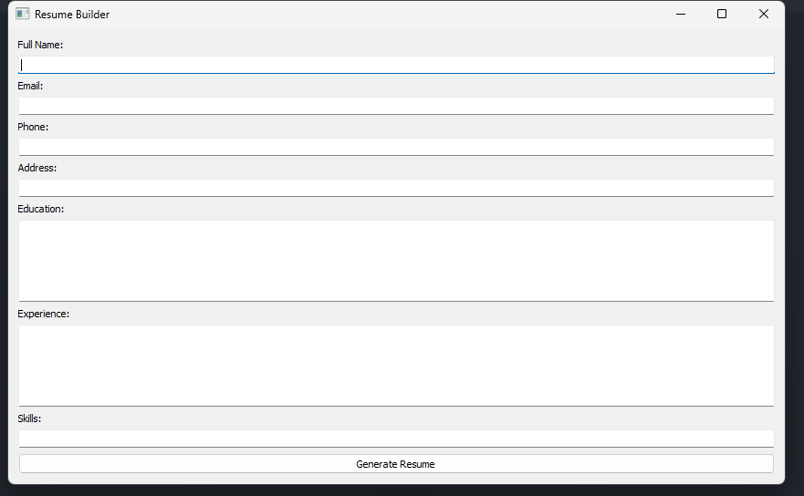

# ResumeBuilder
A free ResumeBuilder made in Python uses PyQt5 GUI and saves resume in a PDF file upon taking input.

How to Use:-
pip install requirements.txt 

--This installs the required modules to run the script. 

1. run py ResumeBuilder.py to run the GUI
2. Fill in your information
3. Click on Generate Resume
4. Save the file to your specified path as a pdf file.

 Here's a sample resume output as pdf file 

